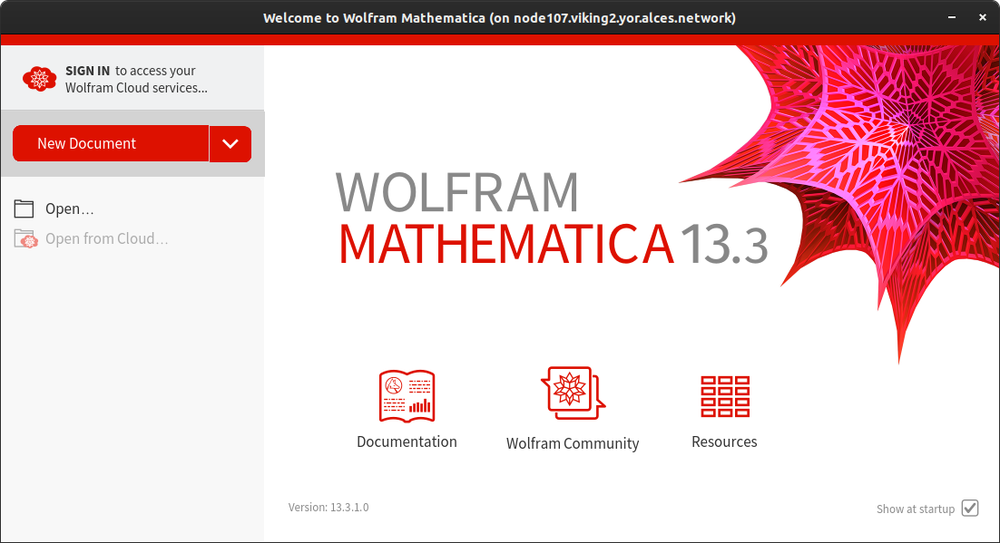

Mathematica
===========

`Mathematica <https://www.wolfram.com/mathematica>`_ is a computational software program used in many scientific, engineering, mathematical and computing fields. Whilst it is possible to use `wolframscript <https://reference.wolfram.com/language/workflow/RunWolframLanguageCodeFromTheCommandLine.html>`_ on the command line, you can use the GUI on Viking and harness Viking's powerful compute nodes in the process.

As mentioned previously, when you first log into Viking you are on one of the two ``login nodes``. These are for light work and simple testing so to use Mathematica on a compute node we will need to:

1. Log into Viking with ``X11 forwarding`` e.g. ``ssh -X viking.york.ac.uk``
2. Request a compute node with the ``salloc`` command
3. ``ssh`` into the node where the resources were allocated
4. Load the ``{MOD_MATHEMATICA}`` module
5. Run ``mathematica`` and the GUI should appear locally

.. note::

    For this to work you must be running an ``xserver`` on your local machine which will display the ``Mathematica`` window. On Linux and MacOS this is most likely included and for Windows 10 / 11 `Xming <https://sourceforge.net/projects/xming/files/latest/download>`_ is a great solution. Without a locally running ``xserver`` this will not work.

SSH forwarding
--------------

Log into Viking with the ``-X`` option: ``ssh -X abc123@viking.york.ac.uk`` replacing ``abc123`` with your username. This option enables the ``X11 Forwarding`` over the ``ssh`` connection. This allows a program to run on Viking yet *forward* the window to our local machine where it is diplayed.

Request resources
-----------------

Use the ``salloc`` command to request some resources on Viking for example:

.. code-block:: console
    :caption: this describes one node, one task, eight CPU cores, 16G or memory for two hours

    $ salloc --nodes=1 --ntasks=1 --cpus-per-task=8 --mem=16g --time=2:0:0

The resources may take a few minutes depending on your request and how busy Viking is, but when they are allocated you are able to ``ssh`` into the node where the resources are allocated.

SSH into the node
-----------------

We have only been allocated the resources, currently we are still on the login node. To access the allocated resources we ``ssh`` into them, again with the ``-X`` option. Slurm has a handy environment variable to help here ``$SLURM_NODELIST`` which we can use as follows:

.. code-block:: console

    $ ssh -X $SLURM_NODELIST

You should shortly be logged into the node and the command prompt will change for example:

.. code-block:: console

   [abc123@node051[viking2] ~]$

We are now logged into the compute node with the requested resources and ready to run ``Mathematica``.

Run Mathematica
---------------

Load the ``Mathematica`` module. You can search for it with the ``module spider Mathematica`` and load it with the following:

.. code-block:: console

    $ module load {MOD_MATHEMATICA}

Once loaded, run ``mathematica`` and after a short moment it should appear on your screen:

.. code-block:: console

    $ mathematica

Tidy up
-------

When finished, exit ``Mathematica`` and we need to relinquish the resources which ``salloc`` granted us. After ``Mathematica`` has closed, on the terminal command line press ``Ctrl + d`` **twice**, once to exit the ``ssh`` session and log out of the compute node. The second time is to relinquish the job allocation. You should get confirmation in the terminal this has occurred. If needed, you can list all your queued jobs with ``squeue -u $USER`` and if you see something you wish to cancel you can use ``scancel`` followed by the ``JOBID`` from the previous command.
