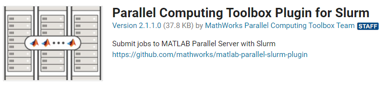
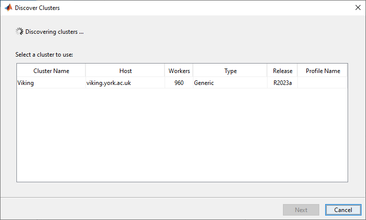
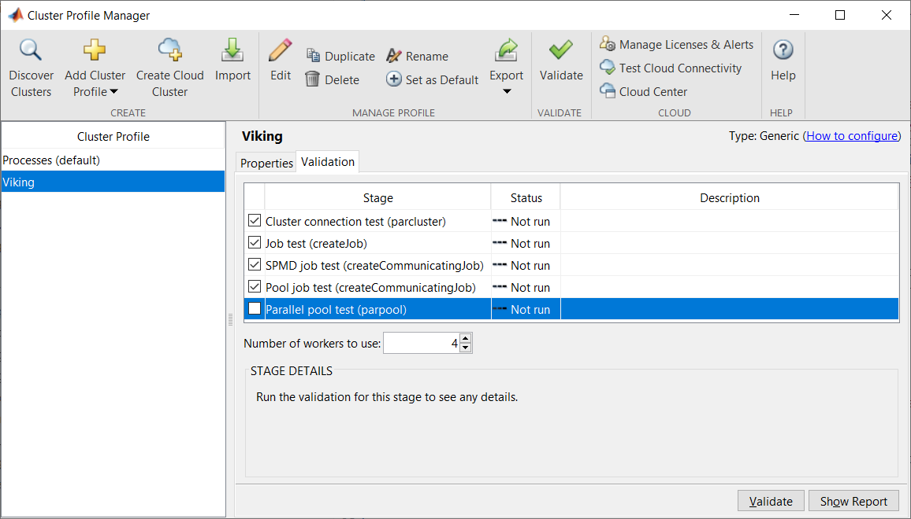
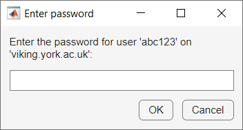

MATLAB
======

MATLAB can be used with Viking in several different ways. These include:

* :ref:`Interactively with a GUI - full MATLAB GUI <matlab-running-interactively-with-a-gui>`
* :ref:`Interactively without a GUI - MATLAB command line <matlab-running-interactively-without-a-gui>`
* :ref:`Batch mode - submit jobs from your local MATLAB GUI <matlab-batch-mode-from-local-gui>`
* :ref:`Batch mode - submit jobs from the Viking terminal <matlab-batch-mode-from-viking-terminal>`

The instructions for each of these methods are provided below.

.. _matlab-running-interactively-with-a-gui:

Running interactively with a GUI
--------------------------------

Using MATLAB interactively on Viking with a GUI is similar to using MATLAB on your own computer. The :doc:`Virtual desktops <../using_viking/virtual_desktops>` page and specifically the section on :ref:`Compute nodes <virtual_session_compute_node>` explains how to run MATLAB in a virtual desktop on Viking's compute nodes. This gives you access to the normal MATLAB GUI and all of its graphical functionality. Please ensure that you **do not** run the MATLAB GUI on :doc:`Viking's login nodes <../getting_started/code_of_conduct>`.

.. _matlab-running-interactively-without-a-gui:

Running interactively without a GUI
-----------------------------------

If you don't need any of the GUI or interactive graphical elements of MATLAB but still want to use MATLAB interactively then use this method.  Once you have :doc:`connected to one of the login nodes via SSH <../getting_started/connecting_to_viking>`, the first step is to :ref:`create an interactive session <interactive-jobs>` on a compute node. Please ensure that you **do not** run MATLAB on :doc:`Viking's login nodes <../getting_started/code_of_conduct>`.

To create an interactive session on a compute node for 30 minutes, with 4 cores and 20 GB of memory enter the following command in the terminal:

.. code-block:: console

    $ srun --ntasks=1 --cpus-per-task=4 --mem=20GB --time=00:30:00 --pty bash

Once the resources have been assigned, you need to load the MATLAB module, then start MATLAB without a GUI.

.. code-block:: console

    $ module load {MOD_MATLAB}
    $ matlab -nojvm -nodisplay

MATLAB will start in the terminal window and you will be at the MATLAB command prompt ``>>``. You can now use the MATLAB command line as normal.

.. code-block:: console

                            < M A T L A B (R) >
                  Copyright 1984-2023 The MathWorks, Inc.
             R2023b Update 2 (23.2.0.2391609) 64-bit (glnxa64)
                            September 22, 2023

    For online documentation, see http://www.mathworks.com/support
    For product information, visit www.mathworks.com.

    >>

To close MATLAB just type ``exit`` at the MATLAB prompt. To end the interactive session and release your resources to other users type ``exit`` again or ``Ctrl+D`` and you will be returned to a login node.

.. note::

    When your requested time has expired the interactive session and MATLAB will end and any unsaved data will be lost.

Different resources can be assigned to the interactive session by changing the ``srun`` command options. This includes the :doc:`partition <../using_viking/resource_partitions>`. For example, to request a GPU compute node with one GPU use:

.. code-block:: console

    $ srun --partition=gpu --gres=gpu:1 --ntasks=1 --cpus-per-task=4 --mem=20GB --time=00:30:00 --pty bash

For more information on starting MATLAB from the Linux command prompt see the `MATLAB documentation site <https://uk.mathworks.com/help/matlab/ref/matlablinux.html>`_.

.. _matlab-batch-mode-from-local-gui:

Batch mode - submit jobs from your local MATLAB GUI
---------------------------------------------------

MATLAB can also be run in batch mode, i.e non-interactively. This model of execution fits nicely with HPC systems like Viking, where work can be submitted to the scheduler to be executed. This section explains how to submit batch jobs from MATLAB running on your local computer.

There are some prerequisites and some set up steps required before you can use this method of interacting with Viking and MATLAB.

Prerequisites
^^^^^^^^^^^^^

* An account on Viking - see the :doc:`Creating an account page <../getting_started/creating_accounts>` for information on how to get an account
* You must either be on campus or connected via the `VPN <https://www.york.ac.uk/it-services/services/vpn/>`_ for this method to work
* A version of MATLAB on your local computer which matches a version on Viking - currently ``2023a`` and ``2023b``. Version ``2023a`` is available on managed Windows computers via the Software Center.
* MATLAB's Parallel Computing Toolbox installed on your local MATLAB instance. This should be present by default on managed devices. The ``ver`` command in MATLAB will list all the installed toolboxes. If you don't have it then see this `MATLAB Answers post <https://uk.mathworks.com/matlabcentral/answers/101885-how-do-i-install-additional-toolboxes-into-an-existing-installation-of-matlab>`_ for how to install toolboxes with existing installations of MATLAB.

Initial Setup
^^^^^^^^^^^^^

Your local instance of MATLAB needs to be able to interact with the job scheduler on Viking, which is called *Slurm*. You need to download the *Parallel Computing Toolbox plugin for MATLAB Parallel Server with Slurm*. This is available via MATLAB's *Add On Explorer*. In your local instance of MATLAB click the *Add On* button in the *Environment* section of the Home toolbar. In the Add-On Explorer search for ``slurm``. You should then see the following as one of the search results: 



Select this add-on. If a pop-up appears asking that you *acknowledge you will be accessing unsupported content made available under separate license terms* then click on *OK*. Then click on the *Add* button and select *Add to MATLAB, Download and add to path*. If you are not already signed in to MathWorks then you will be asked to sign in. You do not need to create an account, just enter your university email address in the pop-up and you will be redirected to the University's Single Sign On (SSO) screen where you should then enter your University username and password. The download and installation with then start automatically.

The next step is to download the :download:`viking.conf<../assets/downloads/viking.conf>` cluster profile configuration file. This file is used to automatically generate a cluster profile within MATLAB that tells it how to interact with Viking and Slurm. In most cases you **must** save the :download:`viking.conf<../assets/downloads/viking.conf>` file in your user's *Downloads* folder on your computer. However, if you are using a Windows Active Directory managed computer (see `this support page <https://support.york.ac.uk/s/article/Managed-Windows-Azure-AD-and-AD>`_ to determine which type of managed Windows device you are using) then you **must** save the cluster profile configuration file in your user's home folder, which will be ``C:\Users\abc123``.

Then in your local instance of MATLAB click the *Parallel* button in the *Environment* section of the Home toolbar and select *Discover Cluster...*. In the pop-up window make sure that only *On your network* is ticked and click on *Next*. Viking should be automatically discovered and you should see the following:



Click on *Viking* to highlight it then click *Next*. The following screen should inform you that *You have successfully added the cluster profile Viking*. You should un-tick the *Set new cluster profile as default* tick box, then click *Finish*. Open the *Cluster Profile Manager* by clicking on *Create and Manage Clusters...* from the *Parallel* menu button in the *Environment* section of the Home toolbar. Then select the *Viking* cluster profile. The ``JobStorageLocation`` will be empty, so you must click the *Edit* button and then *Done*. The ``JobStorageLocation`` should now show ``current working folder (default)``. You can specify a different local folder if required.

If you are using a managed Windows (Azure Active Directory), Mac or Linux computer then no further setup is required and you can skip to the cluster profile validation section. If you are using a Windows Active Directory managed computer then you must update the ``PluginScriptsLocation`` as explained below. See `this support page <https://support.york.ac.uk/s/article/Managed-Windows-Azure-AD-and-AD>`_ to determine which type of managed Windows device you are using. (Note that most newer Windows devices are managed by Azure AD so no changes are required).

If you are using an unmanaged computer then you will need to update the following fields in the *Scheduler Plugin* section of the cluster profile. Click the *Edit* button in the bottom right to change the values.

* The ``PluginScriptsLocation`` field needs to be changed to the location of the *Parallel Computing Toolbox plugin for MATLAB Parallel Server with Slurm*. You can easily find this by entering ``path`` at the MATLAB prompt. Copy and paste the full path of the folder ``Parallel Computing Toolbox Plugin for Slurm``. For example on a Windows Active Directory managed computer the path might be: ``C:\Users\abc123\AppData\Roaming\MathWorks\MATLAB Add-Ons\Collections\Parallel Computing Toolbox Plugin for Slurm``
*  In the ``AdditionalProperties`` section update following fields:

    * Update the username within the ``RemoteJobStorageLocation`` path to your University username, e.g. ``/users/abc123/scratch/.matlab/generic_cluster_jobs``
    * Update the ``Username`` field to your University username, e.g. ``abc123``

Click *Done* to save the changes.

Cluster Profile Validation
^^^^^^^^^^^^^^^^^^^^^^^^^^

The next step is to validate the cluster profile to ensure that it is correctly configured. In the *Cluster Profile Manager* window click on the *Viking* cluster profile. Then click the *Validation* tab to the right of the *Properties* tab. **Do not** click the *Validate* button with the big green tick on the toolbar. In the *Validation* tab you should un-tick the *Parallel pool test (parpool)* option and enter the value ``4`` in the *Number of workers to use:* box. Your window should look as follows:



Then click on the *Validate* button. If the cluster profile configuration is correct the first test *Cluster connection test (parcluster)* will pass and you will then be prompted for your password:



When you've entered your password the remaining three tests will be run. Note that it can take several minutes for each of the tests to complete. If the validation completes successfully you will see the following:

.. image:: ../assets/img/validation_passed.png

If any of the tests showed *Failed* and a red cross next to them ensure that you correctly followed all of the prerequisites and initial setup steps. If this does not resolve the failures then save a copy of the *Validation Report* by clicking the *Show Report* button then the *Save Report...* button on the *Validation Report* window that pops up. To seek further assistance you should email itsupport@york.ac.uk and attach this report.

Submitting Batch Jobs
^^^^^^^^^^^^^^^^^^^^^

The initial setup and cluster profile validation only need to be completed once. But you will still need to be either on campus or connected via the VPN to submit batch jobs. You will also be prompted to enter your password the first time you connect to Viking during a session.

The first step is to create a cluster object using the Viking cluster profile:

.. code-block:: console

    c = parcluster('Viking')

You can then submit your job using the MATLAB `batch <https://uk.mathworks.com/help/parallel-computing/batch.html>`_ command.

.. code-block:: console

    myjob = batch(c, 'scriptname')

This will submit the job with the default resources requested, i.e. 1 core, 5.2 GB of RAM for 15 minutes on the ``nodes`` partition. Note that the script you are submitting is stored on your local computer and must be accessible by MATLAB. Do not include the ``.m`` file extension in the ``batch`` command.

If you require multiple cores, e.g. your script uses a `parfor <https://uk.mathworks.com/help/parallel-computing/parfor.html>`_ loop, then use the ```pool``` option to specify the number of workers (i.e. number of cores). Note that MATLAB requires one additional worker to coordinate the pool so the actual number of cores used is one greater than the number requested. To request 8 workers use the following command:

.. code-block:: console

    myjob = batch(c, 'scriptname', 'pool', 8)

You can also modify and add properties to the cluster object which will determine the resources requested for the job. The following commands will request 6 GB of memory per core and request the resources for 30 minutes:

.. code-block:: console

    c.AdditionalProperties.MemPerCPU = '6GB';
    c.AdditionalProperties.WallTime = '00:30:00';

You can also use this approach to specify the :doc:`partition <../using_viking/resource_partitions>`. The following command will request the ``week`` partition:

.. code-block:: console

    c.AdditionalProperties.Partition = 'week';

For more information see the MathWorks `run a batch job help page <https://uk.mathworks.com/help/parallel-computing/run-a-batch-job.html>`_ and the `batch <https://uk.mathworks.com/help/parallel-computing/batch.html>`_ command help page.

Once you have submitted a job or jobs you can continue to use MATLAB as normal or close it as the jobs will be queued or running on Viking. You can use the `Job Monitor <https://uk.mathworks.com/help/parallel-computing/job-monitor.html>`_ located in the *Parallel* menu in the *Environment* section of the toolbar to check the status of your job.

When a job is completed you can load the job's variables into your local workspace by right-clicking on the job in the Job Monitor and selecting *Load Variables*. You can also use the `load <https://uk.mathworks.com/help/parallel-computing/parallel.job.load.html>`_ command. If your script writes output to the command window then you can display its output by right-clicking on the job in the Job Monitor and selecting *Show Diary* or the `diary <https://uk.mathworks.com/help/parallel-computing/parallel.job.diary.html>`_ command.

When you no longer need the job you can delete its data and remove it from the workspace:

.. code-block:: console
    
        delete(myjob)
        clear myjob

.. Note::
    MATLAB on Viking will currently only work on a single node at a time, so multi-node jobs are not yet possible. This is currently being investigated.

.. Note::
    Please provide any feedback on this guide by emailing itsupport@york.ac.uk

.. _matlab-batch-mode-from-viking-terminal:

Batch mode - submit jobs from the Viking terminal
-------------------------------------------------

Batch jobs for MATLAB can be :doc:`submitted via a jobscript <../using_viking/submitting_jobs>` in the same way as for other software on Viking.

The following job script can be used to submit a MATLAB script to Viking, using 4 cores and 12GB of memory for 15 minutes. The following assumes that you have a MATLAB script ``matlab_batch_example.m`` either in the job's working directory, or in the MATLAB search path:

.. code-block:: bash
    :caption: example MATLAB batch mode script - matlab_jobscript.job
    :linenos:

    {SHEBANG}
    #SBATCH --job-name=matlab_batch_example   # Job name
    #SBATCH --partition=nodes                 # What partition the job should run on
    #SBATCH --time=0-00:15:00                 # Time limit (DD-HH:MM:SS)
    #SBATCH --ntasks=1                        # Number of MPI tasks to request
    #SBATCH --cpus-per-task=4                 # Number of cores per task
    #SBATCH --mem=12G                         # Job memory request
    #SBATCH --account=dept-proj-year          # Project account to use
    #SBATCH --mail-type=END,FAIL              # Mail events (NONE, BEGIN, END, FAIL, ALL)
    #SBATCH --mail-user=abc123@york.ac.uk     # Where to send mail
    #SBATCH --output=%x-%j.log                # Standard output log
    #SBATCH --error=%x-%j.err                 # Standard error log

    # Abort if any command fails
    set -e

    # Purge any previously loaded modules
    module purge

    # Load modules
    module load {MOD_MATLAB}

    # Commands to run
    matlab -batch matlab_batch_example

.. note::
    **Do not** include the ``.m`` extension, which is part of the ``matlab_batch_example.m`` filename, in the job script when calling ``matlab -batch`` command, as shown.

To submit the job to Viking :doc:`connect to one of the login nodes via SSH <../getting_started/connecting_to_viking>`, navigate to the location on Viking that you saved the ``matlab_jobscript.job`` file and then run the following ``sbatch`` command:

.. code-block:: console

    $ sbatch matlab_jobscript.job

See the :doc:`Submitting jobs <../using_viking/submitting_jobs>` and :doc:`Jobscript examples <../using_viking/jobscript_examples>` pages for more information.

Standalone MATLAB programs
--------------------------

It is possible to create standalone MATLAB programs from your MATLAB projects, and these can be run on Viking. An advantage of doing this is that when running a standalone program, MATLAB does not check out a licence from the licence server, which means somebody else who has to run ``MATLAB`` interactively will be able to do so even if your MATLAB program is running!

You can find documentation about how to create standalone MATLAB programs in the `MathWorks help pages <https://uk.mathworks.com/help/compiler/standalone-applications.html>`_, and we recommend using mcc, the ``MATLAB`` compiler, as a straightforward way to create standalone programs.

Certain MATLAB features are not available in standalone programs, so it is worth being aware of what these are to avoid trouble when running your program. You can find a list of `ineligible features <https://uk.mathworks.com/support/requirements/product-requirements-platform-availability-list.html>`_, and comprehensive documentation of `supported features <https://uk.mathworks.com/products/compiler/compiler_support.html?s_tid=srchtitle>`_.

.. code-block:: console
    :caption: start an interactive session and load the MATLAB module

    $ srun --ntasks=1 --time=00:30:00 --pty /bin/bash
    $ module load {MOD_MATLAB}

Your ``MATLAB`` code will need to be in the form of a function. The following example calculates an nxn magic square, where the user gives the input ``n``.

.. code-block:: matlab
    :caption: magicsquare.m

    function m = magicsquare(n)

    if ischar(n)
        n=str2double(n);
    end

    m = magic(n);
    disp(m)

To compile magicsquare.m the mcc command can be run in ``MATLAB`` itself or from the command line:

.. code-block:: matlabsession
    :caption: in MATLAB

    >> mcc -m magicsquare.m

.. code-block:: console
    :caption: on the command line

    $ mcc -m magicsquare.m

If you encounter the following error it is because the compiler has detected that you have a ``startup.m`` file in your MATLAB path and this may cause issues if you distribute your standalone program. This `MATLAB Answers post <https://uk.mathworks.com/matlabcentral/answers/362818-why-does-creating-a-standalone-application-generate-a-warning-regarding-startup-m-adding-paths>`_ provides more details.

.. error::

    Warning: Your deployed application may fail because file or folder paths not present in the deployed environment may be included in your MATLAB startup file. Use the MATLAB function "isdeployed" in your MATLAB startup file to determine the appropriate execution environment when including file and folder paths, and recompile your application.

Running standalone programs
^^^^^^^^^^^^^^^^^^^^^^^^^^^

Standalone MATLAB programs require the MATLAB Compiler Runtime ``MCR`` to run. This requires the MATLAB module to be loaded either in your interactive session or in your job script. Make sure that the version you load is the same version that was used when you compiled the program.

.. code-block:: console

    $ module load {MOD_MATLAB}

When you run your standalone program, either in an interactive session or in a job script, you should use the bash script created during compilation to execute the program. The script has ``run_`` before the name of your source ``.m`` file. You must also use the environment variable ``$EBROOTMATLAB`` after the bash script name to specify where the MCR is and then give any arguments that are required (in this example the number 5 is passed to the program to generate a 5x5 magic square).

.. code-block:: console
    :caption: run a standalone program

    $ ./run_magicsquare.sh $EBROOTMATLAB 5

