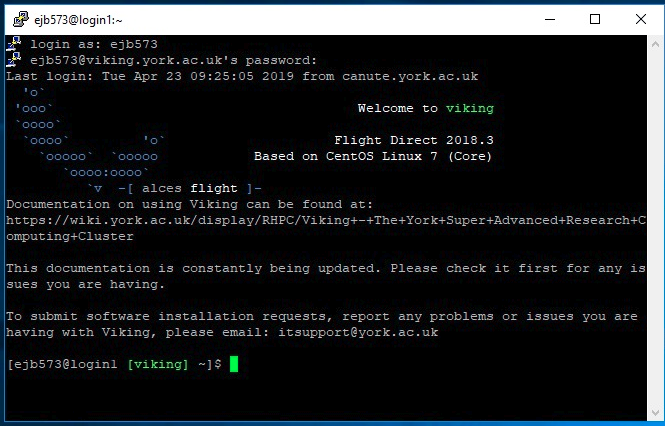

Connecting to Viking
====================

.. hint::
    Before you can connect to Viking you'll need a :ref:`project code and a user account<creating-an-account>`.

To access Viking you'll need to be on the campus network or using the VPN.

Terminal Access
---------------

Linux and MacOS
^^^^^^^^^^^^^^^

To log in from a terminal emulator, use the following command:

.. code-block:: console

    ssh viking.york.ac.uk

You will be prompted for your IT Services password.

.. hint::
    X11 forwarding will only work on the Viking login nodes, which means that you won't be able to run graphical applications e.g. MATLAB on the Viking compute nodes using X11 forwarding. Details about virtual desktop sessions on Viking `can be found here <FIXME: link to X11 forwarding>`_.

Windows
^^^^^^^

For terminal access to Viking from a Windows desktop, you will need to install `PuTTY <https://www.chiark.greenend.org.uk/~sgtatham/putty/>`_ (or comparable software).

Configuring PuTTY to Connect to Viking
"""""""""""""""""""""""""""""""""""""""

Open PuTTY and configure it to connect to Viking:

1. Add the name 'viking.york.ac.uk' to the 'Host Name' field
2. Check the 'Connection Type' to SSH
3. Type the name 'Viking' in 'Saved Sessions'
4. Click 'Save'

.. image:: img/putty1.png

Connecting to Viking
"""""""""""""""""""""

1. Start PuTTY
2. Select 'Viking' from the 'Saved Sessions'
3. Click 'Open'

.. image:: img/putty2.png

A terminal window should appear. Log in with your university username and password.

.. image:: img/putty3.png

If you are successful this is what you will see:

