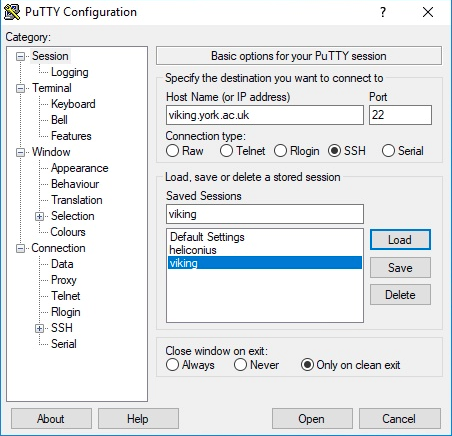
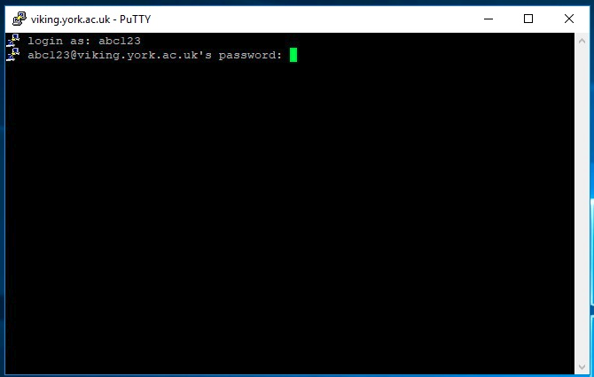
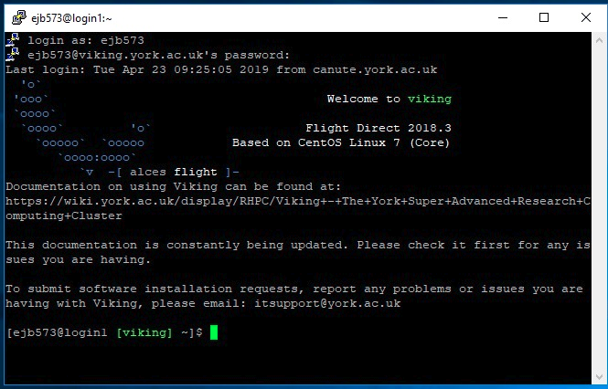

Connecting to viking
====================

.. hint::
    Before you can connect to Viking you'll need a :ref:`project code and a user account<creating-an-account>`.

To access Viking you'll need to be on the campus network or using the VPN :doc:`which you can read about here. </getting_started/connecting_off_campus>`

For the time being if you are using the ``eduroam`` WiFi you need to connect to Viking as if you are off campus and use the University VPN.

.. attention::

    The ``ssh fingerprints`` for the two login nodes are listed below. If you connected to the old Viking previously then you will probably see a warning that the fingerprint has changed. The correct fingerprints for the two login nodes are:

    .. code-block:: console

        SHA256:e6QUl1pE1RK55unuALoNDXaEvJLcam4LJo6P07nbGcs (RSA)
        SHA256:jn1KdPw+M9iws+uEwsnuqC5NVph4eNT095m22RFz4Mw (ECDSA)
        SHA256:TztJ/bGgPiK6bIGfQqRQnxfg/nVhw978T6kyy9HhJTQ (ED25519)

Terminal access
---------------

Linux and macOS
^^^^^^^^^^^^^^^

To log in from a terminal emulator, use the following command:

.. code-block:: console

    $ ssh viking.york.ac.uk

You will be prompted for your IT Services password. If you're using a personal device then you'll need to add your IT Services username for example:

.. code-block:: console

    $ ssh abc123@viking.york.ac.uk

.. hint::
    X11 forwarding will only work on the Viking login nodes, which means that you won't be able to run graphical applications e.g. MATLAB on the Viking compute nodes using X11 forwarding. Details about virtual desktop sessions on Viking :doc:`can be found here </using_viking/virtual_desktops>`.

.. _connecting-via-windows:

Windows
^^^^^^^

For terminal access to Viking from a Windows desktop, you will need to install `PuTTY <https://www.chiark.greenend.org.uk/~sgtatham/putty/>`_ (or comparable software).

Configuring PuTTY to connect to viking
"""""""""""""""""""""""""""""""""""""""

Open PuTTY and configure it to connect to Viking:

1. Add the name 'viking.york.ac.uk' to the 'Host Name' field
2. Check the 'Connection Type' to SSH
3. Type the name 'Viking' in 'Saved Sessions'
4. Click 'Save'

Connecting to viking
"""""""""""""""""""""

1. Start PuTTY
2. Select 'Viking' from the 'Saved Sessions'
3. Click 'Open'

A terminal window should appear. Log in with your University username and password.

If you are successful this is what you will see:

