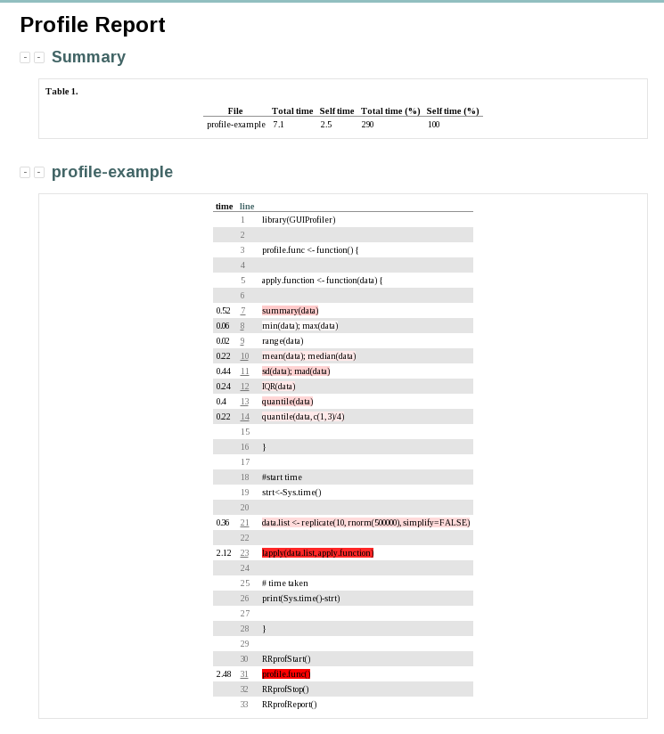
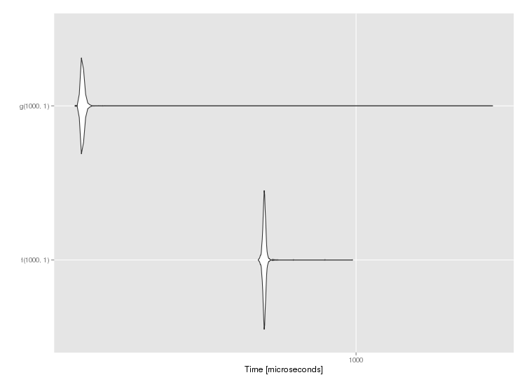

.. include:: global.rst

Program Specific Jobscripts
===========================

This section of documentation goes over various programs installed on Viking which are more complicated than average to use.

All of the example files shown on these pages can be downloaded or can be found on Viking at

.. code-block:: console

    /mnt/lustre/groups/viking-examples/program_job_scripts

.. note::

    These scripts are generic and as such you will need to insert your specific details for them to function correctly.

.. tip::

    In each section there may be an example ``module load`` command. Newer versions may be available so please try the command ``module spider NAME`` where 'NAME' is the software to search for, and you will be presented with the currently available list.

Amber
-----

There are two installations of ``Amber``, one which only supports running on CPUs, and one which supports running on GPUs (using CUDA). Use the module command to load the required version (note that you can not use both at the same time):

.. code-block:: console
    :caption: load the desired Amber module

    $ module load chem/Amber/16-foss-2018a-AmberTools-17-CUDA
    $ module load chem/Amber/16-intel-2018b-AmberTools-17-patchlevel-10-15

The following job script could be used to submit an ``Amber`` workflow to the cluster, using 1 core and 4.8GB of memory for 2 hours. The following assumes that you have defined in the script ``amber_cpu_example.sh`` an ``Amber`` workflow, e.g. `minimisation and molecular dynamics <https://ambermd.org/tutorials/basic/tutorial1/section4.php>`_:

.. code-block:: bash
    :linenos:
    :caption: Example **CPU** Amber Script

    #!/bin/bash
    set -e
    #SBATCH --job-name=amber_cpu_example           # Job name
    #SBATCH --account=PROJECT-ACCOUNT-2020         # Your Viking project account code
    #SBATCH --partition=nodes                      # Partition for the job
    #SBATCH --ntasks=1                             # Run a single task
    #SBATCH --cpus-per-task=1                      # Number of cores per task
    #SBATCH --mem=4800MB                           # Job memory request
    #SBATCH --time=00:02:00                        # Time limit hrs:min:sec
    #SBATCH --output=%x.log                        # Standard output and error log
    #SBATCH --mail-type=ALL                        # Events to receive emails about
    #SBATCH --mail-user=a.user@york.ac.uk          # Where to send mail

    module load chem/Amber/16-intel-2018b-AmberTools-17-patchlevel-10-15
    ./amber_cpu_example.sh

The following job script could be used to submit an ``Amber`` workflow to the GPU partition in the cluster, using 1 core, 4.8GB of memory, and 1 GPU for 2 hours. The following assumes that you have defined in the script ``amber_gpu_example.sh`` an ``Amber`` workflow which makes use of GPUs:

.. code-block:: bash
    :linenos:
    :caption: Example **GPU** Amber Script

    #!/bin/bash
    set -e
    #SBATCH --job-name=amber_gpu_example           # Job name
    #SBATCH --account=PROJECT-ACCOUNT-2020         # Your Viking project account code
    #SBATCH --partition=gpu                        # Partition for the job ('gpu' for the GPU partition)
    #SBATCH --ntasks=1                             # Run a single task
    #SBATCH --cpus-per-task=1                      # Number of cores per task
    #SBATCH --mem=4800MB                           # Job memory request
    #SBATCH --gres=gpu:1                           # Select 1 GPU
    #SBATCH --time=02:00:00                        # Time limit hrs:min:sec
    #SBATCH --output=%x.log                        # Standard output and error log
    #SBATCH --mail-type=END,FAIL                   # Events to receive emails about
    #SBATCH --mail-user=a.user@york.ac.uk          # Where to send mail

    module load chem/Amber/16-foss-2018a-AmberTools-17-CUDA
    ./amber_gpu_example.sh

.. tip::

    FIXME: Add in benchmarks like old docs

Gaussian
--------

``Gaussian`` can be loaded using the following:

.. code-block:: console

    $ module load chem/Gaussian/G16a03

This job script can be used to submit a ``Gaussian`` workflow to the cluster, using 16GB of memory, 16 cores and 48 hours. This assumes you have a gaussian file called g16.gjf . Remember to update the account code and email address provided to ``slurm`` to your own details.

.. code-block:: bash
    :linenos:

    #!/bin/bash
    set -e
    #SBATCH --job-name=Gaussian_CPU_example    # Job Name
    #SBATCH --account=PROJECTCODE              # Project account
    #SBATCH --mail-type= BEGIN, END, FAIL      # Mail events (NONE, BEGIN, END, FAIL, ALL)
    #SBATCH --mail-user=abc123@york.ac.uk      # Where to send mail
    #SBATCH --ntasks=1
    #SBATCH --cpus-per-task=16
    #SBATCH --mem=16gb
    #SBATCH --time=48:00:00
    #SBATCH --output=output.log
    #SBATCH --partition=nodes
    module purge                               # purge any loaded modules
    module load chem/Gaussian/G16a03
    g16 g16.gjf

.. note::

    Gaussian can be run both with and without a GPU

As ``Gaussian`` is licensed software, you will need to be added to the Gaussian group on Viking in order to use it. If you find that you can't use ``Gaussian`` on Viking due to permission errors, please get in touch with Viking support via an email to itsupport@york.ac.uk.

MATLAB
------

``MATLAB`` can be loaded using the following command:

.. code-block:: console

    $ module load math/MATLAB/2021a

.. attention::

    FIXME: New docs reference a jobscript emailed to Emma - can we get a copy?

Running Interactively
^^^^^^^^^^^^^^^^^^^^^

``MATLAB`` can be run interactively both with and without a Graphical User Interface (GUI). When running ``MATLAB`` interactively, please ensure that you are doing so :ref:`inside an interactive cluster session <virtual-session-compute-node>`, rather than on :doc:`Viking's login nodes <code-of-conduct>`.

The following demonstrates how you could run ``MATLAB`` interactively without the GUI:

.. code-block:: console

    srun --ntasks=1 --mem-per-cpu=4800MB --time=00:30:00 --pty bash
    module load math/MATLAB/2018a
    matlab -nojvm -nodisplay -nosplash

                            < M A T L A B (R) >
                  Copyright 1984-2018 The MathWorks, Inc.
                   R2018a (9.4.0.813654) 64-bit (glnxa64)
                             February 23, 2018

    For online documentation, see http://www.mathworks.com/support
    For product information, visit www.mathworks.com.

To run ``MATLAB`` interactively with the graphical user interface, you must first set up a :ref:`virtual desktop session on a compute mode <virtual-session-compute-node>`. Ensure that you use the command ``start-interactive-session.sh`` to set up your interactive job, rather than ``srun``. Note that these commands take the same parameters.

.. code-block:: console
    :caption: using ``start-interactive-session.sh`` as opposed to ``srun`` for the interactive session

    $ start-interactive-session.sh --ntasks=1 --mem-per-cpu=4800MB --time=00:30:00 --pty bash
    $ module load math/MATLAB/2018a
    $ matlab

In your virtual desktop session, you should now see the ``MATLAB`` graphical interface which is running on a compute node.

Running in Batch mode
^^^^^^^^^^^^^^^^^^^^^

``MATLAB`` (2019a and newer) can also be run in batch mode, i.e non-interactively. This model of execution fits nicely with HPC systems like Viking, where work can be submitted to the scheduler to be executed.

The following job script could be used to submit a ``MATLAB`` script to the cluster, using 1 core and 4.8GB of memory for 2 hours. The following assumes that you have a ``MATLAB`` script ``matlab_batch_example.m`` either in the job's working directory, or in the ``MATLAB`` search path:

.. code-block:: bash
    :caption: example MATLAB batch mode script
    :linenos:

    #!/bin/bash
    set -e
    #SBATCH --job-name=matlab_batch_example        # Job name
    #SBATCH --account=PROJECT-ACCOUNT-2020         # Your Viking project account code
    #SBATCH --partition=nodes                      # Partition for the job
    #SBATCH --ntasks=1                             # Run a single task
    #SBATCH --cpus-per-task=1                      # Number of cores per task
    #SBATCH --mem=4800MB                           # Job memory request
    #SBATCH --time=00:02:00                        # Time limit hrs:min:sec
    #SBATCH --output=%x.log                        # Standard output and error log
    #SBATCH --mail-type=ALL                        # Events to receive emails about
    #SBATCH --mail-user=a.user@york.ac.uk          # Where to send mail

    module load math/MATLAB/2021a
    matlab -batch matlab_batch_example

.. note::
    **Do not** include the ``.m`` extension, which is part of the ``matlab_batch_example.m`` filename, in the job script when calling ``matlab -batch`` command, as shown.

Standalone MATLAB Programs
^^^^^^^^^^^^^^^^^^^^^^^^^^

It is possible to create standalone ``MATLAB`` programs from your ``MATLAB`` projects, and these can be run on Viking. An advantage of doing this is that when running a standalone program, ``MATLAB`` does not check out a licence from the licence server, which means somebody else who has to run ``MATLAB`` interactively will be able to do so even if your ``MATLAB`` program is running!

You can find documentation about how to create standalone ``MATLAB`` programs in the `MathWorks help pages <https://uk.mathworks.com/help/compiler/standalone-applications.html>`_, and we recommend using mcc, the ``MATLAB`` compiler, as a straightforward way to create standalone programs.

Certain ``MATLAB`` features are not available in standalone programs, so it is worth being aware of what these are to avoid trouble when running your program. You can find a list of `ineligible features <https://uk.mathworks.com/support/requirements/product-requirements-platform-availability-list.html>`_, and comprehensive documentation of `supported features <https://uk.mathworks.com/products/compiler/compiler_support.html?s_tid=srchtitle>`_.

.. code-block:: console
    :caption: start an interactive session and load the MATLAB module

    $ srun --ntasks=1 --time=00:30:00 --pty /bin/bash
    $ module load math/MATLAB/2021a

Your ``MATLAB`` code will need to be in the form of a function. The following example calculates an nxn magic square, where the user gives the input ``n``.

.. code-block:: matlab
    :caption: magicsquare.M

    function m = magicsquare(n)

    if ischar(n)
        n=str2double(n);
    end

    m = magic(n);
    disp(m)

To compile magicsquare.m the mcc command can be run in ``MATLAB`` itself or from the command line:

.. code-block:: matlabsession
    :caption: in MATLAB

    >> mcc -m magicsquare.m

.. code-block:: console
    :caption: on the command line

    $ mcc -m magicsquare.m

If you encounter the following error it is because the compiler has detected that you have a ``startup.m`` file in your ``MATLAB`` path and this may cause issues if you distribute your standalone program. This `MATLAB Answers post <https://uk.mathworks.com/matlabcentral/answers/362818-why-does-creating-a-standalone-application-generate-a-warning-regarding-startup-m-adding-paths>`_ provides more details.

.. error::

    Warning: Your deployed application may fail because file or folder paths
    not present in the deployed environment may be included in your MATLAB startup
    file. Use the MATLAB function "isdeployed" in your MATLAB startup file to
    determine the appropriate execution environment when including file and folder
    paths, and recompile your application.

Certain ``MATLAB`` features are not available in standalone programs, so it is worth being aware of what these are to avoid trouble when running your program. You can find a list of ineligible features here, and comprehensive documentation of supported features `here <https://uk.mathworks.com/products/compiler/compiler_support.html?s_tid=srchtitle>`_.

Running Standalone Programs
"""""""""""""""""""""""""""

Standalone ``MATLAB`` programs require the ``MATLAB`` Compiler Runtime ``MCR`` to run. This requires the ``MATLAB`` module to be loaded either in your interactive session or in your job script. Make sure that the version you load is the same version that was used when you compiled the program.

.. code-block:: console

    $ module load math/MATLAB/2021a

When you run your standalone program, either in an interactive session or in a job script, you should use the bash script created during compilation to execute the program. The script has ``run_`` before the name of your source ``.m`` file. You must also use the environment variable ``$EBROOTMATLAB`` after the bash script name to specify where the MCR is and then give any arguments that are required (in this example the number 5 is passed to the program to generate a 5x5 magic square).

.. code-block:: console
    :caption: run a standalone program

    $ ./run_magicsquare.sh $EBROOTMATLAB 5

MongoDB
-------

MongoDB can be loaded using the following command:

.. code-block:: console

    $ module load tools/MongoDB/4.2.3

When using `MongoDB`, you have to explicitly state the location of the database or ``mongod`` will error out as shown in the first option for ``mongod`` below. If you are using a unix socket you should also specify it's location, shown in the second option for ``mongod`` below.

.. code-block:: console

    $ mongod --dbpath $HOME/scratch/mongod/db --unixSocketPrefix $HOME/scratch/mongod

R - For Statistical Computing
-----------------------------

To see what `R` versions are available, use the following command. Note the trailing slash in the command, without this Ruby modules will also be included in the results

.. code-block:: console

    $ module spider lang/R

One of these versions can then be loaded as following. Here we use ``lang/R/4.2.1-foss-2022a`` as an example

.. code-block:: console

    $ module load lang/R/4.2.1-foss-2022a

An example of a batch script using `R` can be seen here. This script uses an `R` file named ``buckeye_bayes-bpflat``, 16GB, 16 CPUs and 48 hours. Remember to update the account code and email address provided to ``slurm`` to your own details.

Submitting Simple R Scripts to the Cluster
^^^^^^^^^^^^^^^^^^^^^^^^^^^^^^^^^^^^^^^^^^

The following Job Script will run the R code with the default number of CPUs and memory.

.. code-block:: r
    :caption: Example Simple R Script - simple.R

    args <- commandArgs(trailingOnly = TRUE)
    number=as.numeric(args[1])
    string=args[2]
    print(sprintf("R script called with arguments \'%s\' and \'%s\'", number, string))

.. code-block:: bash
    :caption: Job Script to run simple.R

    #!/bin/bash
    set -e
    #SBATCH --job-name=Simple-R                  # Job name
    #SBATCH --mail-type=BEGIN,END,FAIL           # Mail events (NONE, BEGIN, END, FAIL, ALL)
    #SBATCH --mail-user=my.name@york.ac.uk       # Where to send mail
    #SBATCH --time=00:02:00                      # Time limit hrs:min:sec
    #SBATCH --output=logs/Simple-R-%j.log        # Standard output and error log
    #SBATCH --account=my-account-2018            # Project account

    echo `date`: executing R script simple on host ${HOSTNAME}
    echo
    Rscript --no-save --no-restore simple.R 93 "The end of the world is not today"
    echo
    echo `date`: completed R script simple on host ${HOSTNAME}

Asking for more Cores and Memory
^^^^^^^^^^^^^^^^^^^^^^^^^^^^^^^^

R jobs that require more memory can use the ``--mem`` directive.

R scripts that make use of threading can use the ``--cpus-per-task`` directive to ask to more cores.

The following script uses 4 cores and 24GB of memory.

.. code-block:: bash

    #!/bin/bash
    set -e
    #SBATCH --job-name=Simple-R                  # Job name
    #SBATCH --mail-type=BEGIN,END,FAIL           # Mail events (NONE, BEGIN, END, FAIL, ALL)
    #SBATCH --mail-user=andrew.smith@york.ac.uk  # Where to send mail
    #SBATCH --ntasks=1                           # Run a single task
    #SBATCH --cpus-per-task=4                    # Number of CPU cores per task
    #SBATCH --mem=24gb                           # Job memory request
    #SBATCH --time=00:05:00                      # Time limit hrs:min:sec
    #SBATCH --output=logs/Sinc2core-%j.log       # Standard output and error log
    #SBATCH --account=ITS-SYSTEM-2018            # Project account

    echo `date`: executing sinc2core R test on host ${HOSTNAME} with $SLURM_CPUS_ON_
    NODE slots
    Rscript --no-save sinc2core.R $SLURM_CPUS_ON_NODE

Profiling Your Code
^^^^^^^^^^^^^^^^^^^

Overview
""""""""

Profiling code refers to the process of analysing it's performance to highlight slow sections or flaws.

GUIProfiler Package
""""""""""""""""""""

This package can be used to profile your code. Note that at the start of your R program, you will need to import it, as seen on the first line below. Then wrap your function between ``RRprofStart()``, ``RRprofStop()`` and ``RRprofReport()`` as seen at the bottom of the program.

.. code-block:: r

    library(GUIProfiler)

    profile.func <- function() {

    apply.function <- function(data) {

    summary(data)
    min(data); max(data)
    range(data)
    mean(data); median(data)
    sd(data); mad(data)
    IQR(data)
    quantile(data)
    quantile(data, c(1, 3)/4)

    }

    #start time
    strt<-Sys.time()

    data.list <- replicate(10, rnorm(500000), simplify=FALSE)

    lapply(data.list, apply.function)

    # time taken
    print(Sys.time()-strt)

    }

    RRprofStart()
    profile.func()
    RRprofStop()
    RRprofReport()

This will produce a a report as seen below, highlighting the slower performing sections of the code.

    output from ``RRprofReport()``

For more information on the ``GUIProfiler Package``, please see the PDF reference manual on the `package page <https://cran.r-project.org/web/packages/GUIProfiler/>`_.

A quick and easy way to speed up your code
""""""""""""""""""""""""""""""""""""""""""

To speed up your code, compile your functions where possible. This can be achieved using the ``cmpfun()`` function from the compiler library. An example of this can be seen below, comparing the uncompiled function *f* and the compiled function *g*.

.. code-block:: r

    library(compiler)
    library(ggplot2)
    library(microbenchmark)

    f <- function(n, x) for (i in 1:n) x = (1 + x)^(-1)
    g <- cmpfun(f)

    compare <- microbenchmark(f(1000, 1), g(1000, 1), times = 1000)

    autoplot(compare)

The results of this comparison can be seen below:

    note: the average speed of **g** is significantly lower than that of **f**.

Using multiple cores via the parallel package
"""""""""""""""""""""""""""""""""""""""""""""

Parallel Package
""""""""""""""""

This package provides the mechanisms to support "core-grained" parallelism. Large portions of code can run concurrently with the objective to reduce the total time for the computation. Many of the package routines are directed at running the same function many times in parallel. These functions do not share data and do not communicate with each other. The functions can take varying amounts of time to execute, but for best performance should be run in similar time frames.

The process used by the Parallel package is as follows:

    1. Initialise "worker" processes
    2. Divide users task into a number of sub-tasks
    3. Allocate the task to workers
    4. Wait for tasks to complete
    5. If task still waiting to be processed goto 3
    6. Close down worker processes

Additional documentation on the parallel package can be found in `Chapter 8 of The R Reference Index <https://cran.r-project.org/manuals.html>`_.

foreach and doParallel
""""""""""""""""""""""

Using a foreach loop where early iterations do not affect the later ones facilitates the use of executing the loop in parallel.

.. code-block:: r
    :caption: Simple foreach example

    library(doParallel)

    # simple example
    foreach.example <- function(procs) {

      cl <- makeCluster(procs)
      registerDoParallel(cl)

      #start time
      strt<-Sys.time()

      n <- foreach(y=1:200000) %dopar% {

        sqrt(y) + y^2 + y^3

      }

      # time taken
      print(Sys.time()-strt)

      stopCluster(cl)

    }

.. code-block:: r
    :caption: Parallel execution

    > foreach.example(1)
    Time difference of 2.060153 mins
    > foreach.example(2)
    Time difference of 1.479866 mins
    > foreach.example(4)
    Time difference of 1.831992 mins

VOX-FE
------

VOX-FE can be loaded using the following command:

.. code-block:: console

    $ module load module load bio/VOX-FE/2.0.1-foss-2017b

An example job script can be found here. This script takes 40 CPUs, 1 GB of memory and 2 hours. Remember to update the account code and email address provided to ``slurm`` to your own details.

.. code-block:: bash

    #!/bin/bash
    set -e
    #SBATCH --job-name=VOX-FE_CPU_example       # Job name
    #SBATCH --mail-type=BEGIN,END,FAIL          # Mail events (NONE, BEGIN, END, FAIL, ALL)
    #SBATCH --mail-user=abc123@york.ac.uk       # Where to send mail to
    #SBATCH --ntasks=40
    #SBATCH --cpus-per-task=1
    #SBATCH --nodes=1
    #SBATCH --ntasks-per-node=40
    #SBATCH --ntasks-per-socket=20
    #SBATCH --mem-per-cpu=1gb
    #SBATCH --time=02:00:00
    #SBATCH --output=logs/VOX-FE_CPU_example-node-%j.log
    #SBATCH --account=PROJECTCODE               # Project account

    module purge                                # purge any loaded modules
    module load module load bio/VOX-FE/2.0.1-foss-2017b

    echo "Running small-vox-fe on $SLURM_NTASKS CPU cores"
    echo "Nodes allocated to job: " $SLURM_JOB_NUM_NODES "(" $SLURM_JOB_NODELIST ")"
    echo

    date
    mpirun -np $SLURM_NTASKS PARA_BMU Script.txt
    date

.. note::

    VOX-FE can not take advantage of a GPU, and runs purely on a CPU

Relion
-------

``RELION`` can be loaded using the following command:

.. code-block:: console

    $ module load bio/RELION/4.0.1-foss-2021a

An example script to run ``RELION`` can be seen here using

.. code-block:: bash

    #!/bin/bash
    set -e
    #SBATCH --job-name=RELION_CPU_example          # Job name
    #SBATCH --mail-type=BEGIN,END,FAIL             # Mail events (NONE, BEGIN, END, FAIL, ALL)
    #SBATCH --mail-user=abc123@york.ac.uk          # Where to send mail
    #SBATCH --account=PROJECTCODE                  # Viking account
    #SBATCH --ntasks=1                             # Number of tasks to run
    #SBATCH --mem=4gb                              # Memory requested
    #SBATCH --time=00:30:00                        # Time requested

    module purge                    # Purges all loaded modules

    module load bio/RELION/4.0.1-foss-2021a

    echo
    echo Job started at `date`
    echo Job ID $SLURM_JOB_ID

    mpiexec -n XXXmpinodesXXX XXXcommandXXX

    echo
    echo Job completed at `date`
    echo Job ID $SLURM_JOB_ID

.. note::
    ``RELION`` can use GPUs, and is available on Viking's virtual desktop

Alpha Fold
-----------

`AlphaFold <https://deepmind.com/blog/article/putting-the-power-of-alphafold-into-the-worlds-hands>`_ is an AI system developed by `DeepMind <https://deepmind.com/>`_ that predicts a protein's 3D structure from it's amino acid sequence. The source code for the inference pipeline can be found on their `GitHub <https://github.com/deepmind/alphafold>`_ page.

.. attention::

    Since a few tweaks have been made to the installation, it is important to read through the following documentation before running any jobs with ``AlphaFold``.

The CPU-only version of AlphaFold can be loaded using the following:

.. code-block:: console

    $ module load bio/AlphaFold/2.0.0-foss-2020b

And the GPU version of AlphaFold can be loaded using the following command:

.. code-block:: console

    $ module load bio/AlphaFold/2.0.0-fosscuda-2020b

Example job scripts
^^^^^^^^^^^^^^^^^^^

.. code-block:: bash
    :caption: using 16 CPUs, 80 GBs of memory and for up to 24 hours

    #!/usr/bin/env bash
    set -e
    #SBATCH --job-name=AlphaFold_cpu_example        # Job name
    #SBATCH --nodes=1
    #SBATCH --ntasks-per-node=1
    #SBATCH --cpus-per-task=16
    #SBATCH --mem=80G
    #SBATCH --time=24:00:00
    #SBATCH --output=%x-%j.log
    #SBATCH --mail-type=BEGIN,END,FAIL              # Mail events (NONE, BEGIN, END, FAIL, ALL)
    #SBATCH --mail-user=abc123@york.ac.uk           # Where to send mail
    #SBATCH --account=PROJECTCODE                   # Project account

    module purge                                    # purge any loaded modules
    # Load AlphaFold module
    module load bio/AlphaFold/2.0.0-foss-2020b

    # Path to genetic databases
    export ALPHAFOLD_DATA_DIR=/mnt/bb/striped/alphafold_db/20210908/

    # Optional: uncomment to change number of CPU cores to use for hhblits/jackhmmer
    # export ALPHAFOLD_HHBLITS_N_CPU=8
    # export ALPHAFOLD_JACKHMMER_N_CPU=8

    # Run AlphaFold
    alphafold --fasta_paths=T1050.fasta --max_template_date=2020-05-14 --preset=full_dbs --output_dir=$PWD --model_names=model_1,model_2,model_3,model_4,model_5

.. code-block:: bash
    :caption: using a GPU in addition to 10 CPUs for up to 4 hours

    #!/usr/bin/env bash
    set -e
    #SBATCH --job-name=AlphaFold_GPU_example    # Job name
    #SBATCH --nodes=1
    #SBATCH --ntasks-per-node=1
    #SBATCH --cpus-per-task=10
    #SBATCH --gres=gpu:1
    #SBATCH --partition=gpu
    #SBATCH --time=4:00:00
    #SBATCH --output=%x-%j.log
    #SBATCH --mail-type=BEGIN,END,FAIL          # Mail events (NONE, BEGIN, END, FAIL, ALL)
    #SBATCH --mail-user=abc123@york.ac.uk       # Where to send mail
    #SBATCH --account=PROJECTCODE               # Project account

    module purge                                # purge any loaded modules
    # Load AlphaFold module
    module load bio/AlphaFold/2.0.0-fosscuda-2020b

    # Path to genetic databases
    export ALPHAFOLD_DATA_DIR=/mnt/bb/striped/alphafold_db/20210908/

    # Optional: uncomment to change number of CPU cores to use for hhblits/jackhmmer
    # export ALPHAFOLD_HHBLITS_N_CPU=8
    # export ALPHAFOLD_JACKHMMER_N_CPU=8

    # Run AlphaFold
    alphafold --fasta_paths=T1050.fasta --max_template_date=2020-05-14 --preset=full_dbs --output_dir=$PWD --model_names=model_1,model_2,model_3,model_4,model_5

Notes for using AlphaFold on Viking
^^^^^^^^^^^^^^^^^^^^^^^^^^^^^^^^^^^

``AlphaFold`` currently requires access to various genetic databases such as ``UniRef90``, ``MGnify``, ``BFD``, ``Uniclust30``, ``PDB70`` and ``PDB``.

To avoid needless duplication of large databases across the cluster, these have been made available in a central directory:

.. code-block:: console

    /mnt/bb/striped/alphafold_db/20210908

The name of the subdirectory ``20210908`` indicates the date that the databases were downloaded. The files are hosted on the burst buffer (``/mnt/bb``) - a shared filesystem powered by fast SSDs - which is recommended for ``AlphaFold`` due to the random I/O access patterns. As seen below this can cause jobs to run up to **2x faster** than if the databases were stored on the disk-based lustre filesystem.

It is important to note that we have made a few enhancements to the installation to facilitate easier usage:

- The location to the AlphaFold data can be specified via the ``$ALPHAFOLD_DATA_DIR``  environment variable, so you should define this variable in your AlphaFold job script: ``export ALPHAFOLD_DATA_DIR=/mnt/bb/striped/alphafold-db/20210908``
- A symbolic link named ``alphafold`` , which points to the ``run_alphafold.py script`` , is included. This means you can just use `alphafold`  instead of ``run_alphafold.py`` or ``python run_alphafold.py``.
- The ``run_alphafold.py``  script has been slightly modified such that defining ``$ALPHAFOLD_DATA_DIR``  is sufficient to pick up all the data provided in that location, meaning that you don't need to use options like ``--data_dir``  to specify the location of the data.
- Similarly, the ``run_alphafold.py``  script was tweaked such that the location to commands like ``hhblits``, ``hhsearch``, ``jackhmmer`` or ``kalign`` are already correctly set, and thus options like ``--hhblits_binary_path``  are not required.
- The Python script that are used to run ``hhblits``  and ``jackhmmer``  have been tweaked so you can control how many cores are used for these tools (rather than hard-coding this to 4 and 8 cores respectively).

  - If set, the ``$ALPHAFOLD_HHBLITS_N_CPU``  environment variable can be used to specify how many cores should be used for running ``hhblits``. The default of 4 cores will be used if ``$ALPHAFOLD_HHBLITS_N_CPU`` is not defined. The same applies for ``jackhmmer`` and ``$ALPHAFOLD_JACKHMMER_N_CPU`` .
  - Tweaking either of these may not be worth it however, since test jobs indicated that using more than 4/8 cores actually resulted in worse performance (although this may be workload dependent)

CPU vs GPU performance
^^^^^^^^^^^^^^^^^^^^^^

Shown below are the results of using the ``T1050.fasta`` example mentioned in the ``AlphaFold`` README with different resource allocations.

.. csv-table:: AlphaFold performance
    :file: data/alphafold_performance.csv
    :align: center
    :header-rows: 1

This highlights the importance of requesting resources when using ``AlphaFold``. These results suggest:

  - It is faster for almost all jobs to use the ``AlphaFold`` with the database stored on the burst buffer, ``/mnt/bb``
  - Using a GPU can considerably increase the speed at which a job completes (up to 6x)
  - Using a second GPU does not significantly reduce the runtime for a job
  - Counter intuitively, using more cores can lower performance

VASP
----

``VASP`` can be loaded using the following command:

.. code-block:: console

    $ module load phys/VASP/5.4.4-intel-2018a

.. code-block::
    :caption: example of a batch script using ``VASP`` can be found here using 120 CPU cores, 4750mb of RAM and for one hour.

    #!/usr/bin/env bash
    set -e
    #SBATCH --job-name=VASP_cpu_example   # Job name
    #SBATCH --mail-type=BEGIN,END,FAIL    # Mail events (NONE, BEGIN, END, FAIL, ALL)
    #SBATCH --mail-user=abc123@york.ac.uk # where to send mail
    #SBATCH --nodes=3-18          # Node range
    #SBATCH --spread-job          # Evenly distribute cores
    #SBATCH --ntasks=120          # Num mpi tasks
    #SBATCH --cpus-per-task=1     # Number of CPU cores per task
    #SBATCH --mem-per-cpu=4750mb  # Memory per core
    #SBATCH --time=01:00:00       # Time limit hrs:min:sec
    #SBATCH --output=%x.o%j       # Archer style screen output
    #SBATCH --error=%x.e%j        # Archer style error output
    #SBATCH --account=PROJECTCODE # Project code

    module purge
    module load phys/VASP/5.4.4-intel-2018a
    ulimit -s unlimited

    mpirun -np 120 vasp_std

.. note::

     VASP can take advantage of a GPU

AtChem 2
---------

AtChem2 is a modelling tool for atmospheric chemistry. It is primarily designed to use the Master Chemical Mechanism (MCM), but it can be used with any general set of chemical reactions. The MCM is a near-explicit chemical mechanism which describes the gas-phase oxidation of volatile organic compounds (VOC) in the lower atmosphere. The MCM is available at http://mcm.york.ac.uk/. The latest stable version of AtChem2 can be downloaded from `GitHub <https://github.com/AtChem/AtChem2/releases>`_.

This documentation will take you through getting a copy of the ``AtChem2`` source code, setting up the environment for ``AtChem2`` use, building a model, and submitting a model run to Viking's job scheduler, in batch mode.

Setting up the environment
^^^^^^^^^^^^^^^^^^^^^^^^^^

To work with ``AtChem2`` you will need to load the following modules on Viking:

.. code-block:: console
    :caption: a Fortran compiler

    $ module load toolchain/foss/2021a

.. code-block:: console
    :caption: CMake, for building AtChem2 dependencies

    $ module load devel/CMake/3.20.1-GCCcore-10.3.0

Next, clone a copy of the ``AtChem2`` source code:

.. code-block:: console

    $ git clone https://github.com/AtChem/AtChem2.git atchem2

Then create a directory to contain AtChem2's dependencies

.. code-block:: console

    $ mkdir atchem2_dependencies

Run the following files from the repository to install the dependencies for ``AtChem2``. These will automatically be installed into the directory you have made.

.. code-block:: console
    :caption: CVODE

    $ ./atchem2/tools/install/install_cvode.sh ./atchem2_dependencies $(command -v gfortran)

.. code-block:: console
    :caption: OpenLibm

    $ ./atchem2/tools/install/install_openlibm.sh ./atchem2_dependencies

Make a note of the full path to your ``AtChem2`` dependencies directory by copying the output of the following command, this will be used later to build a model.

.. code-block:: console

    $ realpath ./atchem2_dependencies

At this point, the environment is set up and you are ready to build an AtChem2 model.
