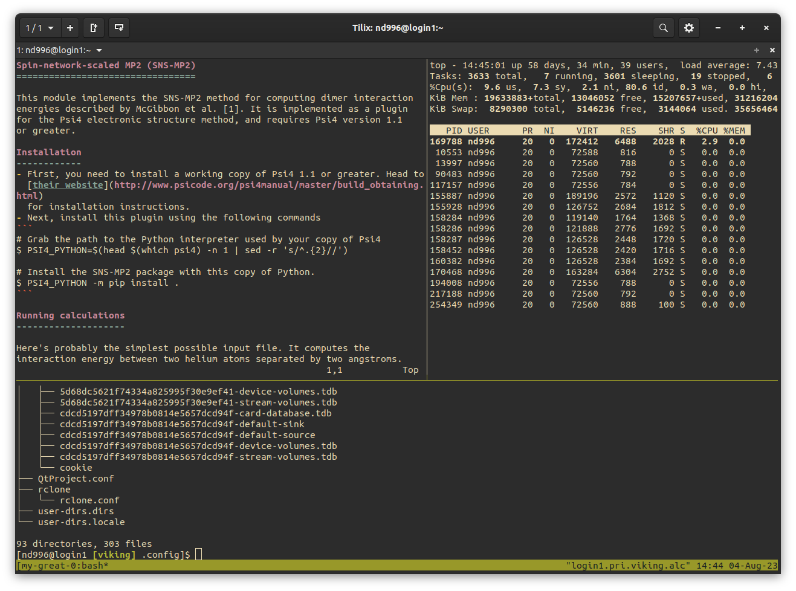

Terminal Multiplexing
=====================

So you're remotely logging into Viking, loading modules and running jobs with the ``sbatch`` or ``srun`` commands, the results are flying in and everything is looking pretty good. But what if you want to monitor the status of something running on Viking, turn off and walk away from your laptop and come back later? Or what if you want to do this with multiple sessions? Well, programs like ``screen`` and ``tmux`` have got you covered.

There is a really good beginners guide to ``screen`` and ``tmux`` on `Xiangyu Li's medium page <https://medium.com/@yiskylee/gnu-screen-and-tmux-which-should-you-choose-de325d32fc2a>`_ and well worth the read if you're new to either program. I prefer ``tmux`` but ``screen`` is totally fine too and it's the only one available on some systems so it's nice to have experience with both.

By logging into Viking, running ``tmux`` then running your programs you can ``detach`` from the session, log out of Viking and return at your leisure and the session and with it's history will be there, pretty cool huh? 😎

.. tip::

    Viking has two login nodes and if you have a ``tmux`` or ``screen`` session on one of the login nodes you will want to log back into the same login node to ``reattach`` to your session. Those addresses are ``viking-login1.york.ac.uk`` and ``viking-login2.york.ac.uk``. If you had a session on a computer node, you would ``ssh`` into any login node first then back to the same compute node and ``reattach``.

Here's another `getting started <https://github.com/tmux/tmux/wiki/Getting-Started>`_ guide for ``tmux`` on their GitHub site, and this is the `full users manual <https://www.gnu.org/software/screen/manual/screen.html>`_ for ``screen`` if you want to dig a little deeper.

    three panes in one session using ``tmux``
