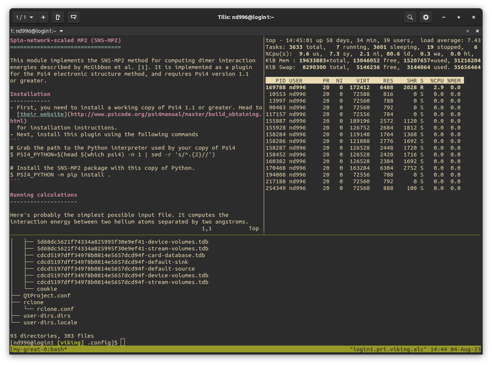

Terminal multiplexing
=====================

Terminal multiplexing allows you to ``detatch`` from a terminal session, leaving any commands running, and come back to it later - as if you never disconnected. You can ``detatch`` and ``attach`` multiple times, and once ``detatched`` you can even turn off your device, leaving the session running on Viking and come back at any time to pick up where you left off.

Programs like ``tmux`` and ``screen`` allow exactly this and are a powerful and timesaving tools when remotely working on Viking. Example use cases are copying or processing large amounts of data or compiling a large codebase. Anything that could take a while which doesn't require constant user input is a good candidate.

Not only that, but you can have multiple terminal sessions running simultaneously and each one can be split up into multiple ``panes`` - imagine a window with multiple panes of glass. This and much, much more!

Rather than copy and paste a beginners guide here, there is already a really good beginners guide to ``screen`` and ``tmux`` on `Xiangyu Li's medium page <https://medium.com/@yiskylee/gnu-screen-and-tmux-which-should-you-choose-de325d32fc2a>`_ and well worth the read if you're new to either program. I probably prefer ``tmux`` but ``screen`` is totally fine and on some Linux systems it's the only available option so it's nice to have experience with both.

By logging into Viking, running ``tmux``, then running your programs you can ``detach`` from the session, log out of Viking and return at your leisure and the session and with its history will be there, pretty cool. 😎

.. tip::

    Viking has two login nodes and if you have a ``tmux`` or ``screen`` session on one of the login nodes you will want to log back into the same login node to ``reattach`` to your session. Those addresses are ``viking-login1.york.ac.uk`` and ``viking-login2.york.ac.uk``.

Here's another `getting started <https://github.com/tmux/tmux/wiki/Getting-Started>`_ guide for ``tmux`` on their GitHub site, and this is the `full users manual <https://www.gnu.org/software/screen/manual/screen.html>`_ for ``screen`` if you want to dig a little deeper.

    three panes in one session using ``tmux``
